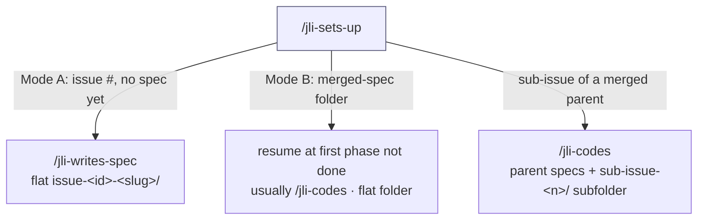
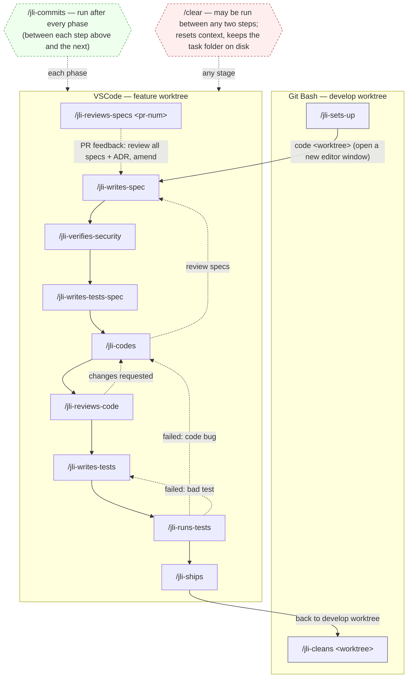

# Agent-to-Command Migration

This document describes how the orchestrator-driven multi-agent pipeline was migrated into a
**manually-chained set of `jli-` slash commands**. The new commands are the supported way to
develop a feature; the old `tackle` / orchestrator flow is deprecated.

## Why

The pipeline was driven by `agent-0-orchestrator`, which spawned every specialist agent via
the Task tool and threaded state through one long-running context. That context overflowed
easily and left the human no natural place to intervene between phases. The manual chain
fixes both: each command is a single, stateless step the human runs by hand, with a `/clear`
allowed between any two steps to keep context small.

## Worktree layout and run location

The repo uses one bare repo with sibling worktrees under a shared parent:

```
<parent>/<repo-name>.git              <- bare repo
<parent>/<repo-name>-develop          <- develop worktree
<parent>/<repo-name>_<type>-<slug>    <- a feature worktree
```

`/jli-sets-up` and `/jli-cleans` run from the **develop worktree**. Every other
command runs from inside the **feature worktree** — you open it in its own editor window
(`code <worktree>`) after setup, and all later commands run in that window.

## How state flows

All state lives in the task folder under the feature worktree:
`docs/prompts/tasks/issue-<id>-<slug>/`. Each command reads the artifacts written by earlier
commands and writes its own. Because the phase/commit/ship commands run _inside_ the feature
worktree, the task folder is a simple relative path — you pass it as a `@`-mention
(`@docs/prompts/tasks/issue-<id>-<slug>`), never an absolute path. The argument is required on
every command, so each one rebuilds what it needs from disk after a `/clear`.

The **specification phase is the input exception**: `/jli-writes-spec` reads the `README.md`
request created by `/jli-sets-up` rather than a prior pipeline artifact.

`/jli-sets-up` has **two entry modes**, chosen by the size of the work:

- **From scratch** (issue number) — the common path for a small feature or bug fix run
  end-to-end in one cycle: it creates the task folder and the chain starts at `/jli-writes-spec`.
- **Continue from a merged spec** (specs folder) — for a larger feature whose spec was
  written, reviewed, and merged to develop in an earlier cycle. The new worktree, branched
  from `origin/develop`, already carries the merged spec artifacts, so no task folder is
  created; setup resumes the chain at the first phase not yet done (normally `/jli-codes`, or
  `/jli-verifies-security` / `/jli-writes-tests-spec` if those artifacts were not part of the
  merged spec). The implementation reuses the spec's own issue and slug.

### Sub-issues of a larger feature

When a large feature is split into sub-issues (each `Sub-Issue X (#parent)` in its title, or
`Part of #parent` in its body), the spec is written once for the **parent** and merged, then
each sub-issue is implemented in its own cycle. `/jli-sets-up` detects a sub-issue number in
Step 1, confirms the switch, and sets up the **sub-issue variant** of Mode B:

- The branch/worktree slug is a short summary of the **sub-issue's own** title (e.g.
  `netlify-oauth-proxy` for #81), not the parent's — one branch/PR per sub-issue.
- The **shared spec artifacts** (`business-specifications.md`, `security-guidelines.md`,
  `test-cases.md`, plus `README.md` / `spec-review.md`) stay in the parent folder
  `docs/prompts/tasks/issue-<parent-id>-<parent-slug>/`.
- Each sub-issue's **own outputs** (`technical-specifications.md`, `review-results.md`,
  `test-results.md`) go in a per-sub-issue subfolder
  `.../issue-<parent-id>-<parent-slug>/sub-issue-<n>/`, which is the `@`-mention passed to
  every downstream command for that sub-issue.
- The implementation-phase commands (`/jli-codes`, `/jli-reviews-code`, `/jli-writes-tests`,
  `/jli-runs-tests`, `/jli-commits`, `/jli-ships`) carry a uniform "Sub-issue task folders"
  rule: read each shared spec from the given folder if present, otherwise from its parent;
  write their own output into the given folder; and parse the issue id from `issue-<id>-<slug>`
  or `sub-issue-<id>`. For a normal (non-sub-issue) folder the parent is never consulted, so
  the rule is a no-op there. The chain resumes at `/jli-codes` since the shared spec is done.
- The `/jli-codes` > `status: review specs` loop-back honours the same layout: `/jli-writes-spec`,
  re-run with the sub-issue subfolder as its argument, reads the feedback (the
  `### Specifications Need Review` section of the subfolder's `technical-specifications.md`) and
  amends the **shared** `business-specifications.md` in the parent. Because that spec is shared,
  the amendment affects every sub-issue of the parent — keep it minimal and flag it.

## Command ↔ agent mapping

| Command                                    | Runs from        | Replaces (agent)                                          |
| ------------------------------------------ | ---------------- | --------------------------------------------------------- |
| `/jli-sets-up <issue-num \| specs-folder>` | develop          | `agent-4-git` Tasks 1–2 (fetch + worktree)                |
| `/jli-writes-spec @<task-folder>`          | feature worktree | `agent-1-specs`                                           |
| `/jli-verifies-security @<task-folder>`    | feature worktree | `agent-5-security`                                        |
| `/jli-writes-tests-spec @<task-folder>`    | feature worktree | `agent-3-test-writer` (pass 1: test cases)                |
| `/jli-codes @<task-folder>`                | feature worktree | `agent-2-coder`                                           |
| `/jli-reviews-code @<task-folder>`         | feature worktree | `agent-6-reviewer`                                        |
| `/jli-writes-tests @<task-folder>`         | feature worktree | `agent-3-test-writer` (pass 2: `*.spec.ts`)               |
| `/jli-runs-tests @<task-folder>`           | feature worktree | `agent-3-test-runner`                                     |
| `/jli-commits @<task-folder>`              | feature worktree | `agent-4-git` commit tasks (3 / 3.5 / 3.7 / 4 / 5-commit) |
| `/jli-ships @<task-folder>`                | feature worktree | `agent-4-git` Tasks 5-push / 6 / 7 (push, PR, merge)      |
| `/jli-cleans <worktree>`                   | develop          | `agent-4-git` Task 8 (worktree cleanup + refresh develop) |
| `/jli-reviews-specs <pr-num>`              | feature worktree | _(new — no agent equivalent)_                             |

`/jli-reviews-specs` is an on-demand review entry, not a linear step: after the spec phase
ships in a PR, it collects the human feedback left on that PR (or given in chat when there is
no PR), reviews all spec-phase artifacts together — business specs, security specs, test
specs, and ADR(s) — for coherence with each other and with the feedback, and loops back into
`/jli-writes-spec` to amend. It runs from the feature worktree like the other phase commands;
if that worktree was cleaned up after the spec PR merged, it first recreates the sibling
worktree on the PR branch (the PR supplies the branch).

`agent-0-orchestrator` is **dissolved** into the "Next" hint at the end of each command — no
command replaces it. The deprecated agents (`agent-0` through `agent-6`) are maintained via
the existing `/fix-pipeline` skill; this repo never had an `agent-7`.

`agent-4-git`'s responsibilities were split into four commands — `setup` (bootstrap),
`commit` (its own step between phases), `ship` (push + PR + merge), and `cleanup` (worktree
removal + refresh develop). `cleanup` is separate because it cannot run from inside the
worktree it removes.

Where the old pipeline ran tests via the `/run-tests` skill, `/jli-runs-tests` now inlines
those exact `npx vitest run --reporter=json | jq …` commands directly, so the chain command
is self-contained.

## The chain

Two diagrams: the **entry modes** (how `/jli-sets-up` gets you onto the chain) and the
**full chain** (the phase flow and loop-backs once you are on it).

### Entry modes



Mode A and Mode B (whole-feature) use a **flat** task folder — `issue-<id>-<slug>/` holds
every artifact. The sub-issue variant is **nested**: shared specs stay in the parent
`issue-<parent-id>-<parent-slug>/`, and each sub-issue's outputs go in its own
`sub-issue-<n>/` subfolder.

### Full chain

The phase flow, the two-editor split, and the loop-backs:



Setup (`/jli-sets-up`) and cleanup (`/jli-cleans`) run in Git Bash (no need for VSCode); a **VSCode window** is opened on the feature
worktree. `/clear` is available at any stage — each command rebuilds what it needs from the
task folder, so clearing context between steps is safe. The same chain in text:

```plaintext
[develop worktree]
/jli-sets-up
  > code <worktree>            (open the feature worktree; everything below runs there)

[feature worktree]
  > /jli-writes-spec        > /jli-commits
  > /jli-verifies-security  > /jli-commits
  > /jli-writes-tests-spec  > /jli-commits      (writes test-cases.md)
  > /jli-codes              > /jli-commits
  > /jli-reviews-code       > /jli-commits
  > /jli-writes-tests       > /jli-commits      (writes *.spec.ts)
  > /jli-runs-tests         > /jli-commits
  > /jli-ships                  (push + PR + merge)

[back in develop worktree]
  > /jli-cleans <worktree>
```

Loop-backs (each command's hint states the branch it took):

- `/jli-reviews-code` > `status: changes requested` > back to `/jli-codes`.
- `/jli-runs-tests` > `status: failed` > back to `/jli-codes` if the code is wrong, or to
  `/jli-writes-tests` if the test is wrong (the human diagnoses which from the failure).
- `/jli-codes` > `status: review specs` > back to `/jli-writes-spec`.
- `/jli-reviews-specs` > `status: review specs` > back to `/jli-writes-spec` (this loop-back is
  driven by PR review feedback rather than by the coder; it runs from the feature worktree,
  reviews all spec-phase artifacts for coherence, and recreates the worktree from the PR branch
  first if it was cleaned up).

The two test phases are separate commands: `/jli-writes-tests-spec` runs **before** coding
and writes the plain-language `test-cases.md`; `/jli-writes-tests` runs **after** review and
turns those cases into `*.spec.ts` files.

## Why the commands are self-contained

Each `.claude/commands/jli-*.md` file inlines its own adapted instructions and contains **no
orchestrator vocabulary and no reference to any `agent-*.md` file**. This is deliberate: the
agent files are written for orchestrator invocation ("the orchestrator passes…", "notify the
orchestrator"), and asking the model to read one and mentally strip that language is fragile.
By sharing no text and no file references, the manual chain and the old pipeline cannot be
confused for one another.

## Human approval gates

The gate is the human deciding to run the next command. Two points are made explicit in the
hints:

- `/jli-writes-spec` and `/jli-codes` warn when their artifact contains `### ADR Required` —
  approve the ADR (add it under `docs/decisions/`, update the index) before continuing.
- `/jli-ships` pauses for confirmation before opening the PR and again before merging,
  because those actions are outward-facing and irreversible.

## Maintaining the chain

Two maintenance commands, by target:

- `/jli-tweaks-command-chain <change>` — edits the **active chain only**: the
  `.claude/commands/jli-*.md` files and this document. It preserves the chain invariants
  (self-containment, argument guard, run location, status-line contract, Next hint)
  and keeps the diagram/mapping here in sync.
- `/fix-pipeline <issue>` — maintains the **deprecated** orchestrator-era agents (now under
  `.claude/deprecated-agents/`) and the `CLAUDE*.md` instructions.

## Deprecated

- `/tackle` and `agent-0-orchestrator.md` — superseded by the `jli-` chain. They carry a
  deprecation banner and remain only for history.
- `agent-0` through `agent-6` brain files were moved to `.claude/deprecated-agents/` so
  Claude Code no longer lists them as dispatchable subagent types. The `jli-` commands are
  the execution path; the deprecated agents are reached only via `/fix-pipeline`.
