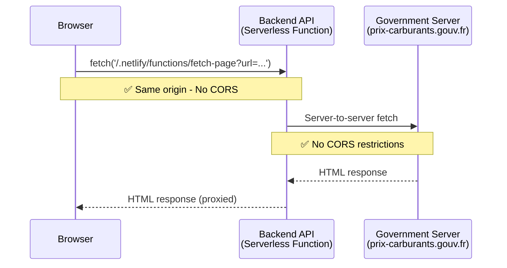

# ADR-006: Use Netlify Functions as Backend Proxy for CORS-Free HTML Fetching

**Date:** 2026-02-13
**Status:** Accepted
**Implemented:** 2026-02-18

## Context

The Vue SPA cannot fetch HTML from gas station pages on `prix-carburants.gouv.fr` due to browser CORS restrictions. Browsers block cross-origin requests unless the target server explicitly allows it with CORS headers, and we do not control CORS headers on `www.prix-carburants.gouv.fr`.

## Decision

**Add Netlify Functions as a backend proxy** to fetch HTML server-side, bypassing CORS entirely.

### High-Level Architecture

**Key points:**

- Function endpoint: `/.netlify/functions/fetch-page?url=<encoded-url>`
- Domain whitelist: `['www.prix-carburants.gouv.fr']`
- Response format: `{ success: true, html: "..." }`

## Rationale

1. **Same Repository**: Functions live alongside SPA, single deployment
2. **Same Origin**: No CORS between SPA and functions (both on `*.netlify.app`)
3. **Zero Infrastructure**: Serverless, auto-scales, free tier sufficient (125k requests/month)
4. **TypeScript End-to-End**: Functions use same TS tooling as SPA
5. **Simple Development**: `netlify dev` runs both SPA and functions locally

## Consequences

### Positive

- ✅ Solves CORS completely (server-to-server has no restrictions)
- ✅ Zero infrastructure cost on free tier
- ✅ Single deployment (push → auto-deploy both)
- ✅ Security via domain whitelist validation
- ✅ TypeScript support built-in

### Negative

- ⚠️ Platform lock-in to Netlify (but migration path exists)
- ⚠️ Cold starts ~100-500ms on first request after idle
- ⚠️ Free tier limited to 125k requests/month (acceptable for MVP)

## Alternatives Considered

1. **CORS Proxy Service** - Rejected: Privacy concerns, reliability, not production-ready
2. **Express Backend** - Rejected: Unnecessarily complex, requires hosting/costs
3. **Browser Extension** - Rejected: Changes product nature, limited audience
4. **Electron Desktop App** - Rejected: Complete architecture pivot

## Acceptance Criteria

- [x] User can fetch HTML from station URLs without CORS errors
- [x] Only whitelisted domains allowed
- [x] All existing tests pass
- [x] Works locally with `netlify dev`
- [ ] Works in production deployment (requires deployment)

## References

- [Netlify Functions Documentation](https://docs.netlify.com/functions/overview/)
- [CORS on MDN](https://developer.mozilla.org/en-US/docs/Web/HTTP/CORS)
