# ADR-011: GitHub OAuth App Authentication via Netlify Functions with HTTP-Only Cookie

**Date:** 2026-04-30
**Status:** Accepted

## Context

Issue #64 introduces the ability for users to sync their preferences to a personal GitHub repository. This requires authenticating the user against GitHub and obtaining an access token that can later be used to call the GitHub Contents API on their behalf.

The application is a Vue 3 SPA with no existing auth layer, deployed on Netlify alongside serverless functions.

Two types of GitHub apps exist:

- **GitHub OAuth App** — authenticates as a user, grants access to their repositories. Simpler to set up and sufficient for reading/writing a single personal JSON file.
- **GitHub App** — installable, acts as its own identity with installation tokens. Needed for org-wide or cross-repo automation. Overkill for this use case.

For token storage in a SPA, three options exist:

- **Memory** — secure but lost on page refresh; user must re-authorize every session.
- **localStorage / IndexedDB** — persistent but accessible to any JavaScript on the page (XSS risk).
- **HTTP-only cookie** — inaccessible to JavaScript; survives page refresh; the standard server-side session pattern.

## Decision

Use a **GitHub OAuth App** with the **Authorization Code flow**, exchanging the code **server-side** inside a Netlify function to keep the Client Secret off the browser. Store the resulting access token in an **HTTP-only, SameSite=Strict, Secure cookie** with a lifetime of **8 hours** (`Max-Age=28800`).

Two Netlify functions handle the flow:

- `github-auth-start` — generates a random `state` value (stored in a short-lived cookie for CSRF protection), then redirects the browser to GitHub's OAuth authorization URL with the correct `client_id`, `scope`, and `state`.
- `github-auth-callback` — receives the `code` and `state` from GitHub's redirect, validates `state`, exchanges `code` for an access token via a server-to-server POST to `https://github.com/login/oauth/access_token`, sets the HTTP-only cookie, then redirects the browser to `/settings?auth=success` (or `/settings?auth=error` on failure).

The SPA detects auth state by calling the GitHub API proxy (ADR-012) and checking whether it returns a valid response or a 401.

Logout is implemented by a Netlify function that clears the cookie.

### OAuth Flow

```mermaid
sequenceDiagram
    actor User as Browser (User)
    participant SPA as Vue SPA
    participant NF_Login as Netlify fn<br/>github-auth-start
    participant NF_CB as Netlify fn<br/>github-auth-callback
    participant GitHub as GitHub OAuth

    User->>SPA: Clicks "Login with GitHub"
    SPA->>NF_Login: GET /.netlify/functions/github-auth-start
    NF_Login-->>User: 302 Redirect → github.com/login/oauth/authorize?client_id=...&scope=repo&state=...
    User->>GitHub: Browser follows redirect (GitHub authorization page)
    User->>GitHub: Authorizes the app
    GitHub-->>User: 302 Redirect → /.netlify/functions/github-auth-callback?code=...&state=...
    User->>NF_CB: Browser follows redirect
    NF_CB->>GitHub: POST github.com/login/oauth/access_token (code + client_secret)
    GitHub-->>NF_CB: { access_token, scope, token_type }
    NF_CB-->>User: 302 Redirect → /settings?auth=success
    Note over NF_CB,User: Set-Cookie: gh_token=...&#59; HttpOnly&#59; SameSite=Strict&#59; Max-Age=28800
    User->>SPA: Browser loads /settings
    SPA->>User: Settings page — authenticated state shown
```

### Credentials Setup

See the "GitHub OAuth App setup" runbook in business-specifications.md, Sub-Issue F, for the full registration and environment-variable steps. Environment variables: `GITHUB_CLIENT_ID`, `GITHUB_CLIENT_SECRET`.

## Rationale

1. **HTTP-only cookie** eliminates XSS token theft — the token is never accessible to JavaScript.
2. **Server-side code exchange** keeps `GITHUB_CLIENT_SECRET` off the browser entirely.
3. **GitHub OAuth App** is sufficient for the required scope (`repo` or `public_repo` depending on user preference) and simpler to set up than a GitHub App.
4. **8-hour lifetime** balances usability (no re-auth during a work session) against security (short enough to limit exposure from a stolen cookie).
5. **SameSite=Strict** prevents CSRF attacks that could trigger GitHub API writes.
6. **Netlify Functions** keeps auth logic in the same repository and deployment as the SPA, consistent with ADR-006.

## Consequences

### Positive

- ✅ Access token never exposed to JavaScript (XSS-safe)
- ✅ CSRF-protected via `state` parameter and `SameSite=Strict`
- ✅ No third-party auth library needed
- ✅ Consistent with existing Netlify Functions pattern (ADR-006)
- ✅ 8-hour cookie survives page refresh without requiring re-auth

### Negative

- ⚠️ Token is not automatically refreshed — expiry is detected on the next 401 from the proxy; user must log in again
- ⚠️ HTTP-only cookie requires HTTPS in production (`Secure` flag); local dev uses `netlify dev` over HTTP (flag is omitted locally)
- ⚠️ `netlify dev` must be used locally (not `npm run dev`) to have the Netlify functions available — consistent with the existing ADR-006 constraint

## Alternatives Considered

1. **PKCE flow (client-side only)**: Would expose the access token in memory or storage — rejected due to XSS risk on a long-lived SPA.
2. **GitHub App with installation tokens**: More powerful but requires app installation by the user and adds significant complexity — overkill for a single personal JSON file.
3. **Memory-only token storage**: Secure but requires re-auth on every page refresh — poor UX for a preferences sync feature.
4. **IndexedDB token storage**: Persistent but accessible to JavaScript — rejected in favour of HTTP-only cookie.
5. **Third-party auth provider (Auth0, Clerk)**: Adds external dependency and cost — unnecessary for a single OAuth provider.

## References

- [GitHub OAuth Apps documentation](https://docs.github.com/en/apps/oauth-apps/building-oauth-apps/authorizing-oauth-apps)
- [ADR-006: Netlify Functions for CORS-Free HTML Fetching](./ADR-006-netlify-functions-for-cors-proxy.md)
